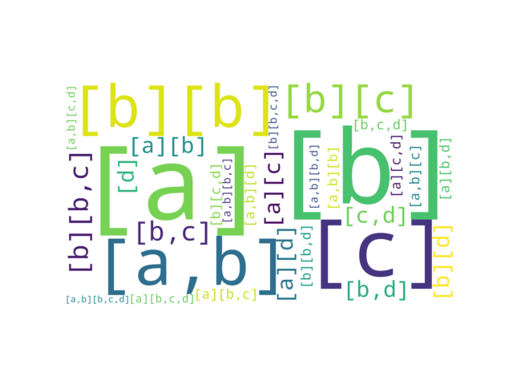
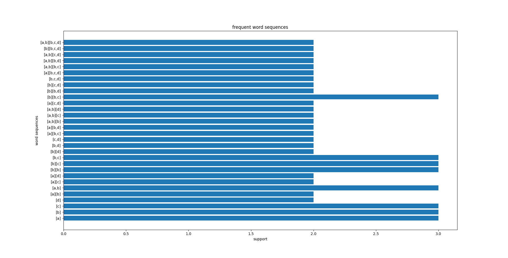

# SPAM

This project includes an implementation of the [Sequential PAttern Mining(SPAM)](https://dl.acm.org/doi/abs/10.1145/775047.775109) algorithm in Python.





```
{'[a]': array([ [1., 0., 0., 0.],
                [0., 1., 0., 0.],
                [1., 0., 0., 0.]]), 
'[b]': array([  [1., 1., 1., 0.],
                [1., 1., 0., 0.],
                [1., 1., 0., 0.]]), 
'[c]': array([  [0., 1., 1., 0.],
                [0., 1., 0., 0.],
                [0., 1., 0., 0.]]), 
'[d]': array([  [1., 1., 1., 0.],
                [0., 0., 0., 0.],
                [0., 1., 0., 0.]]), 
'[a][b]': array([   [0, 1, 1, 0],
                    [0, 0, 0, 0],
                    [0, 1, 0, 0]], dtype=int32), 
'[a,b]': array([    [1, 0, 0, 0],
                    [0, 1, 0, 0],
                    [1, 0, 0, 0]], dtype=int32), 
'[a][c]': array([   [0, 1, 1, 0],
                    [0, 0, 0, 0],
                    [0, 1, 0, 0]], dtype=int32), 
'[a][d]': array([   [0, 1, 1, 0],
                    [0, 0, 0, 0],
                    [0, 1, 0, 0]], dtype=int32), 
'[b][b]': array([   [0, 1, 1, 0],
                    [0, 1, 0, 0],
                    [0, 1, 0, 0]], dtype=int32), 
'[b][c]': array([   [0, 1, 1, 0],
                    [0, 1, 0, 0],
                    [0, 1, 0, 0]], dtype=int32), 
'[b,c]': array([    [0, 1, 1, 0],
                    [0, 1, 0, 0],
                    [0, 1, 0, 0]], dtype=int32), 
'[b][d]': array([   [0, 1, 1, 0],
                    [0, 0, 0, 0],
                    [0, 1, 0, 0]], dtype=int32), 
'[b,d]': array([    [1, 1, 1, 0],
                    [0, 0, 0, 0],
                    [0, 1, 0, 0]], dtype=int32), 
'[c,d]': array([    [0, 1, 1, 0],
                    [0, 0, 0, 0],
                    [0, 1, 0, 0]], dtype=int32), 
'[a][b,c]': array([ [0, 1, 1, 0],
                    [0, 0, 0, 0],
                    [0, 1, 0, 0]], dtype=int32), 
'[a][b,d]': array([ [0, 1, 1, 0],
                    [0, 0, 0, 0],
                    [0, 1, 0, 0]], dtype=int32), 
'[a,b][b]': array([ [0, 1, 1, 0],
                    [0, 0, 0, 0],
                    [0, 1, 0, 0]], dtype=int32), 
'[a,b][c]': array([ [0, 1, 1, 0],
                    [0, 0, 0, 0],
                    [0, 1, 0, 0]], dtype=int32), 
'[a,b][d]': array([ [0, 1, 1, 0],
                    [0, 0, 0, 0],
                    [0, 1, 0, 0]], dtype=int32), 
'[a][c,d]': array([ [0, 1, 1, 0],
                    [0, 0, 0, 0],
                    [0, 1, 0, 0]], dtype=int32), 
'[b][b,c]': array([ [0, 1, 1, 0],
                    [0, 1, 0, 0],
                    [0, 1, 0, 0]], dtype=int32), 
'[b][b,d]': array([ [0, 1, 1, 0],
                    [0, 0, 0, 0],
                    [0, 1, 0, 0]], dtype=int32), 
'[b][c,d]': array([ [0, 1, 1, 0],
                    [0, 0, 0, 0],
                    [0, 1, 0, 0]], dtype=int32), 
'[b,c,d]': array([  [0, 1, 1, 0],
                    [0, 0, 0, 0],
                    [0, 1, 0, 0]], dtype=int32), 
'[a][b,c,d]': array([[0, 1, 1, 0],
                    [0, 0, 0, 0],
                    [0, 1, 0, 0]], dtype=int32), 
'[a,b][b,c]': array([[0, 1, 1, 0],
                    [0, 0, 0, 0],
                    [0, 1, 0, 0]], dtype=int32), 
'[a,b][b,d]': array([[0, 1, 1, 0],
                    [0, 0, 0, 0],
                    [0, 1, 0, 0]], dtype=int32), 
'[a,b][c,d]': array([[0, 1, 1, 0],
                    [0, 0, 0, 0],
                    [0, 1, 0, 0]], dtype=int32), 
'[b][b,c,d]': array([[0, 1, 1, 0],
                    [0, 0, 0, 0],
                    [0, 1, 0, 0]], dtype=int32), 
'[a,b][b,c,d]': array([[0, 1, 1, 0],
                    [0, 0, 0, 0],
                    [0, 1, 0, 0]], dtype=int32)}
```
